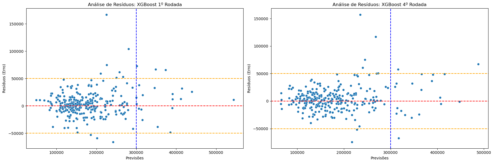

# Previsão de Preços de Imóveis em Ames, Iowa: Uma Abordagem com XGBoost

Este projeto foi desenvolvido como parte do desafio clássico do Kaggle (*House Prices: Advanced Regression Techniques*).  
O objetivo principal é prever o preço final de venda de imóveis residenciais utilizando técnicas avançadas de Engenharia de Atributos (Feature Engineering) e o algoritmo **XGBoost**.

---

## Visão Geral do Projeto

Prever o valor de um imóvel vai muito além de olhar para o seu tamanho, localização e outras características (dando um spoiler do ponto fraco do meu modelo!).  
Este projeto investiga como diversas variáveis interagem para compor o preço de mercado. 

O modelo final atingiu um **Erro Absoluto Médio (MAE) de ~16.336 USD** na validação local, demonstrando uma ótima estabilidade e consistência estatística.

---

## Pipelines e Engenharia de Atributos

O grande diferencial de performance deste modelo não foi o ajuste de algoritmos, mas sim uma investigação mais detalhada nos dados seguida de tratamentos pontuais. O pipeline incluiu:

* **Mapeamento de Regiões:** Agrupamento dos mais de 20 bairros originais em 5 macrorregiões de Ames (North, South, Downtown, etc.), o que ajudou o modelo a reduzir a dispersão dos erros de previsão.
* **Tratamento de nulos e zeros:** Conversão de anos brutos em idades relativas (`HouseAge`, `RemodAge`, `GarageAge`). Adicionalmente foi feita a conversão de variáveis altamente zeradas (como áreas de varanda e lareiras) em indicadores booleanos (`HasPorch`, `HasFireplace`).
* **Conversão de strings para variáveis numéricas:** Diversos fatores utilizados para classificar elementos dos imóveis (ex.: Excelente, Bom, Ruim etc) foram convertidos em variáveis numéricas.
* **Remoção de outliers:** Fatores com maiores correlações passaram por um tratamento outliers.
---

## Análise de Resíduos e Diagnóstico do Modelo

Abaixo está o gráfico comparativo do comportamento dos resíduos entre a primeira versão do modelo e a versão final (com a engenharia de macrorregiões aplicada). 



### Insights do Diagnóstico Técnico:
1. **Efeito das Regiões:** A inclusão das macrorregiões achatou visivelmente a variância do erro, trazendo a nuvem de pontos para mais perto da linha zero.
2. **O Desafio do projeto:** O modelo apresentou dificuldades específicas nos imóveis de ID 688 e 53 (bairros *StoneBr* e *Veenker*, ambos na região *Norte*). A investigação revelou que o algoritmo tende a subestimar o preço de imóveis que possuem áreas compactas acima do solo e/ou menor número de banheiros. Possivelmente outros fatores compensam o valor desses imóveis, mas não foram identificados neste projeto.

---

## Estrutura do Modelo e Hiperparâmetros

O algoritmo escolhido foi o **XGBoost Regressor**, configurado para priorizar a generalização global em detrimento do superajuste a extremos:

* **`max_depth=3`**: Mantido raso para evitar que o modelo sofra de overfiting.
* **`learning_rate=0.005`** e **`n_estimators=5000`**: Um aprendizado lento e robusto assistido por regularização severa (`reg_lambda=3`).
* **Subamostragem (`colsample_bytree=0.4`, `subsample=0.7`)**: Garante que cada árvore olhe para um subconjunto diferente de dados, aumentando a resiliência do modelo.

> **Estabilidade Estatística:** A diferença entre o MAE da validação cruzada (Cross-Validation) e o MAE do conjunto de validação fixo ficou em **apenas 0.96%**, provando que o pipeline é estatisticamente estável e livre de vazamento de dados (*data leakage*).

---

## Como Executar o Projeto

1. Clone o repositório:
   ```bash
   git clone [https://github.com/dfsenra/Housing_Prices_Kaggle](https://github.com/dfsenra/Housing_Prices_Kaggle)
   ```

2. Instale as dependências:
   ```bash
   pip install -r requirements.txt
   ```

3. Abra o arquivo Jupyter Notebook: house_price_xgboost.ipynb. Altere o caminho dos arquivos de treino e teste para refletir o da sua máquina:
   caminho_treino = "/caminho_da_sua_máquina/Housing_Prices_Kaggle/data/train.csv"
   caminho_teste = "/caminho_da_sua_máquina/Housing_Prices_Kaggle/data/test.csv"

4. Execute o Jupyter Notebook: house_price_xgboost.ipynb. Recomendo executar célula por célula para evitar travamento a depender da máquina.

## Conclusões e Próximos Passos

Dada as limitações deste modelo, sugere-se o seu uso focado em imóveis de baixo e médio padrão em Ames. Para uma versão aprimorada, a sugestão seria a criação de variáveis capazes distinguir imóveis de luxo com características compactas.